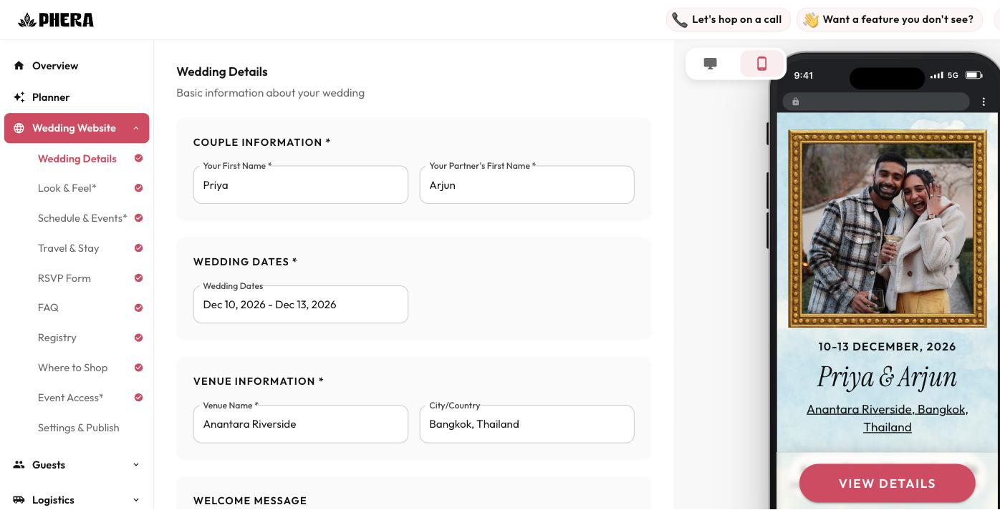

# Phera

Phera is a guest-logistics platform for Indian weddings. These weddings
typically run 300+ guests across 3-5 days of events, with attendees flying
in from multiple countries — Phera handles RSVP tracking, travel
coordination, and guest communication so the couple can focus on the
celebration instead of running it like a part-time job. The platform has a
multi-tenant admin dashboard for couples/planners and a mobile-first guest
portal, with WhatsApp as a first-class channel for both guest communication
and vendor coordination.

## Demo

**Live:** [phera.io](https://www.phera.io) — or jump straight into a working
demo wedding: [phera.io/admin/demo-luid49mg/details](https://www.phera.io/admin/demo-luid49mg/details)
(no login needed).

| Marketing site | Admin dashboard (editing a wedding, live mobile preview) |
|---|---|
|  |  |

## Current focus: the Phera Agent

The active development effort is the **Phera Agent** — a single AI
wedding-planner agent that controls the app through chat (web today,
WhatsApp and voice next). Instead of clicking through admin forms, a couple
can tell the agent what they need and it reads or updates the wedding
directly, pausing for confirmation before anything risky (deletes, bulk
changes, anything that messages guests).

See [`docs/AGENT-PLAN.md`](docs/AGENT-PLAN.md) for the design and
[`CLAUDE.md`](CLAUDE.md) for the current implementation map and working
rules.

## Tech stack

- **Framework:** Next.js 15 (App Router) + React 19 + TypeScript
- **Database:** Supabase (Postgres + RLS + Realtime + Auth)
- **UI:** MUI v7 + Tailwind CSS v4 + Framer Motion
- **Messaging:** Meta WhatsApp Business Cloud API
- **AI:** Anthropic API (agent brain), Groq API, OpenAI API
- **Payments:** Stripe (multi-currency: USD + INR)
- **Deploy:** Vercel
- **Email:** Resend
- **Monitoring:** Sentry
- **Testing:** Vitest + happy-dom + Testing Library

## Running locally

```bash
npm install
cp .env.example .env.local   # fill in Supabase, Stripe, WhatsApp, AI keys
npm run dev
```

The app runs at `http://localhost:3000`.

```bash
npm run test:run   # run the test suite
npm run lint       # lint
```

Database migrations live in `migrations/` and are applied manually via the
Supabase SQL Editor/CLI, in filename order.

## Repo layout

```
app/
  (guest)/           # Guest-facing portal
  admin/             # Admin dashboard, one route tree per wedding
  api/               # API routes
  agent-lab/         # Phera Agent E2E testing UI
lib/
  agent/             # Phera Agent: provider-agnostic loop, tool registry
  supabase/          # Supabase client + service layer
  whatsapp/          # WhatsApp Business Cloud API client + templates
docs/                # Planning, architecture, and strategy docs
migrations/          # SQL migrations (applied manually via Supabase)
mobile/              # React Native app (Expo) — separate package.json
tests/               # Vitest test suite
```

## Documentation

Working rules and project context for AI coding assistants live in
[`CLAUDE.md`](CLAUDE.md) (mirrored for other tools in
[`AGENTS.md`](AGENTS.md)). Deeper planning, architecture, and strategy docs
live under [`docs/`](docs/).
